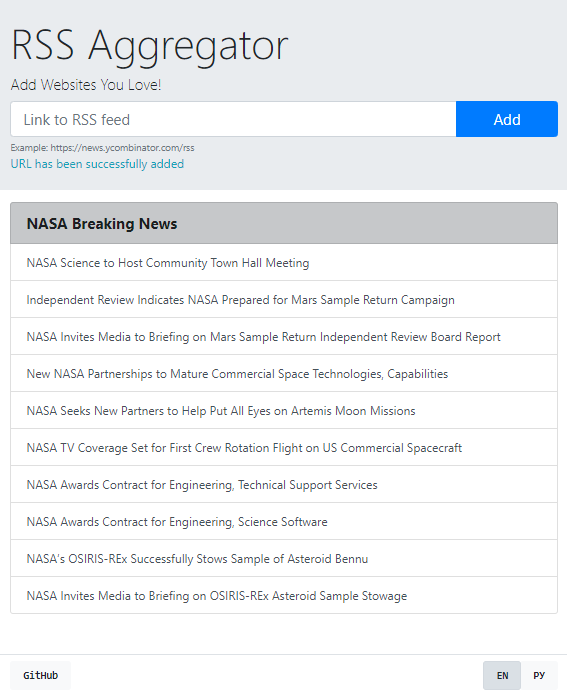

# RSS Aggregator

## Overview

This is an RSS reader.

#### DEMO - https://rss-aggregator.aleksey-vl-ivanov.com

[](https://github.com/alekseyvlivanov/rss-aggregator/actions)
[](https://codeclimate.com/github/alekseyvlivanov/rss-aggregator/maintainability)
[](https://app.netlify.com/sites/rss-aggregator-aleksey-vl-ivanov/deploys)

<div align="center">

</div>

## Features

- DOM manipulation
- form validation
- internationalization (EN/RU)
- MVC
- [All Origins](https://github.com/gnuns/allorigins) is used as a CORS proxy
- using [Makefile](https://makefile.site) for better command management

## Dependencies

- vanilla js
- [axios](https://github.com/axios/axios) for AJAX
- styling with [Bootstrap](https://getbootstrap.com) (css only)
- interface localization with [i18next](https://www.i18next.com)
- [Lodash](https://github.com/lodash/lodash) is used to compare nested objects
- [on-change](https://github.com/sindresorhus/on-change) wathes for state and initiates renderings
- validating form data with [Yup](https://github.com/jquense/yup)

## Install

```
$ git clone ...
$ cd rss-aggregator
$ make  install
```

## Usage

```
$ make develop
```

and open http://localhost:8080 in your browser, or

```
$ make build
```

and deploy somewhere your new **dist** folder.
